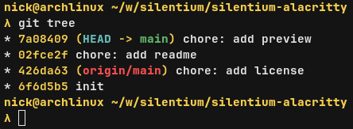

<div align="center">
  <h1>Silentium for Alacritty</h1>
  
</div>

## Usage

1. Save [silentium.toml] to `~/.config/alacritty/` directory.

2. Import the theme in your Alacritty config:
```toml
[general]
import = ["silentium.nvim"]
```

## Compatibility
- Alacritty ≥ 0.12 (TOML-based config)
